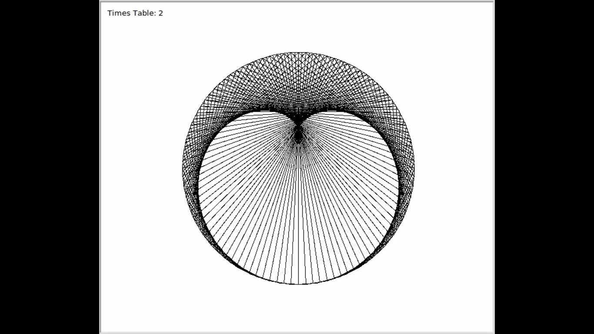
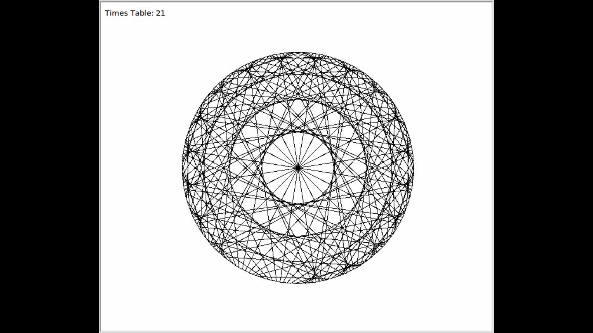
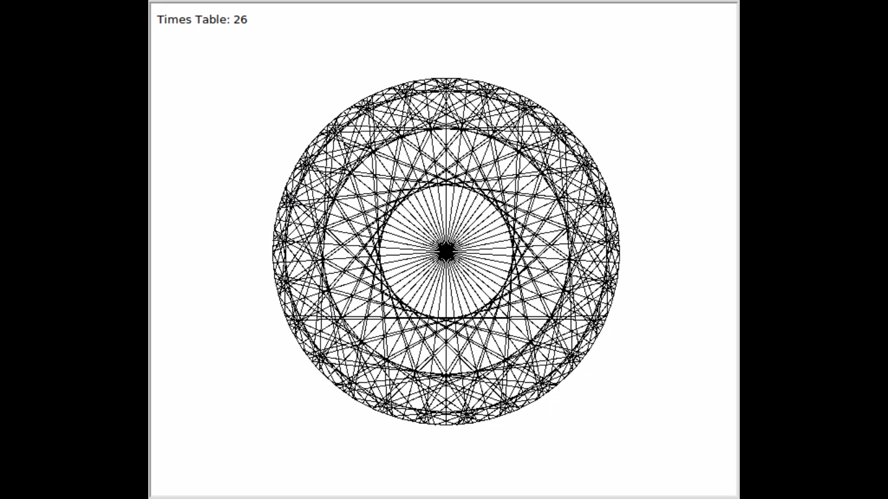
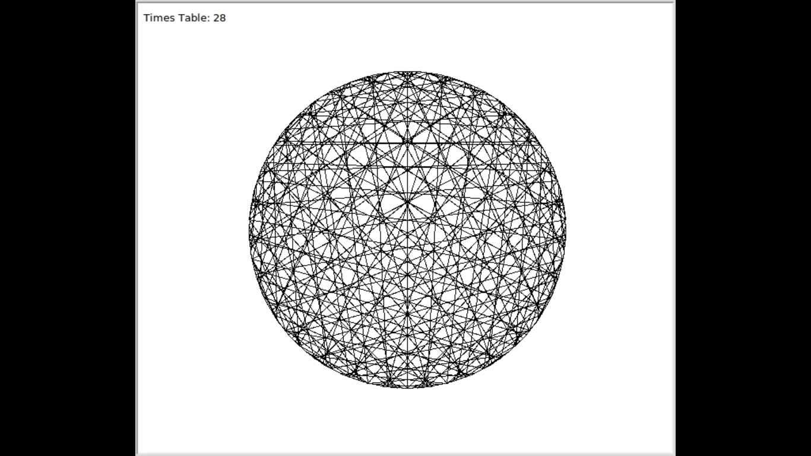
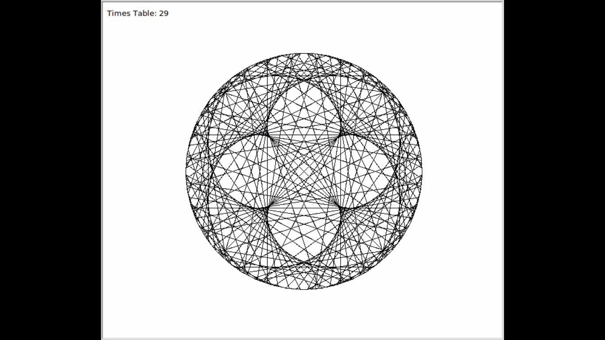
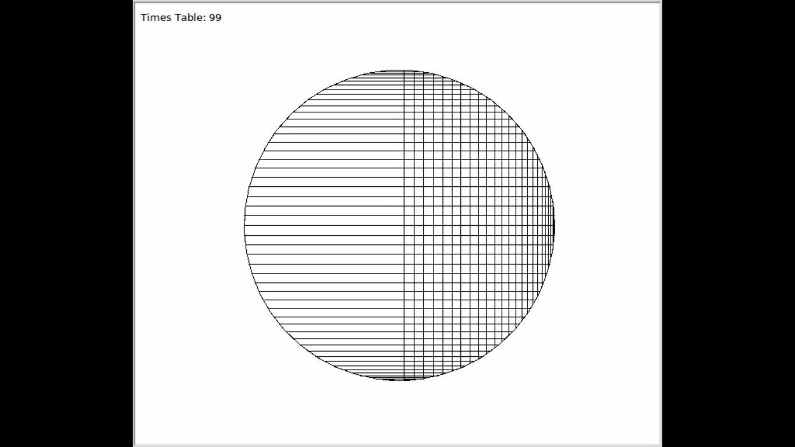

# What is a Cardioid
A cardioid (from the Greek καρδία "heart") is a plane curve traced by a point on the perimeter of a circle that is rolling around a fixed circle of the same radius. It can also be defined as an epicycloid having a single cusp. It is also a type of sinusoidal spiral, and an inverse curve of the parabola with the focus as the center of inversion.  [[Wikipedia]](https://en.wikipedia.org/wiki/Cardioid)

## Some cool drawings generated by cardioid

[Watch the complete video](https://www.youtube.com/watch?v=qS-otrw_ZYU)

    
Time Lapse

    
    
    
    
    
    
    

