# What is a Spiral
In mathematics, a spiral is a curve which emanates from a point, moving farther away as it revolves around the point. [Wikipedia](https://en.wikipedia.org/wiki/Spiral)

## Some cool drawings

    
Time Lapse

    
    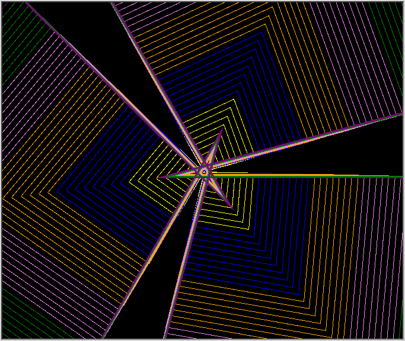
    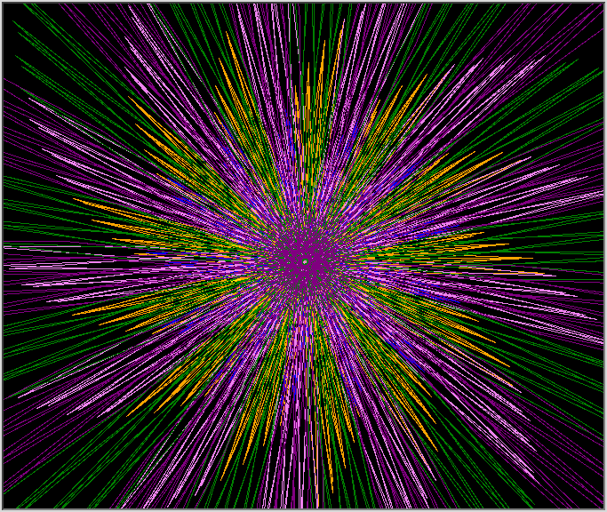
    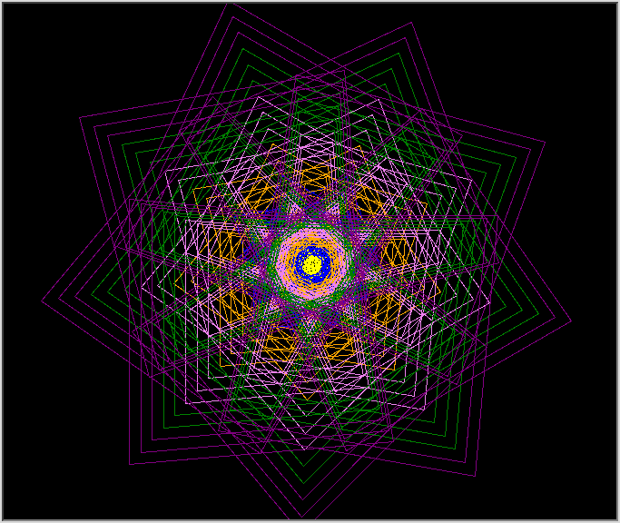
    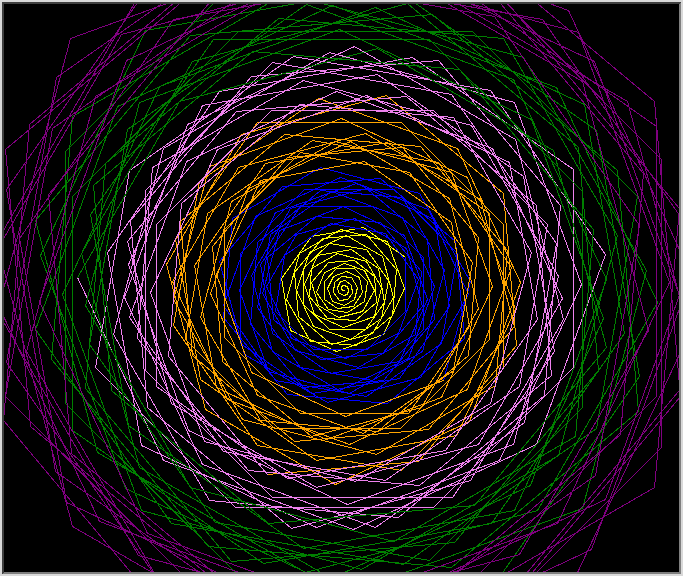
    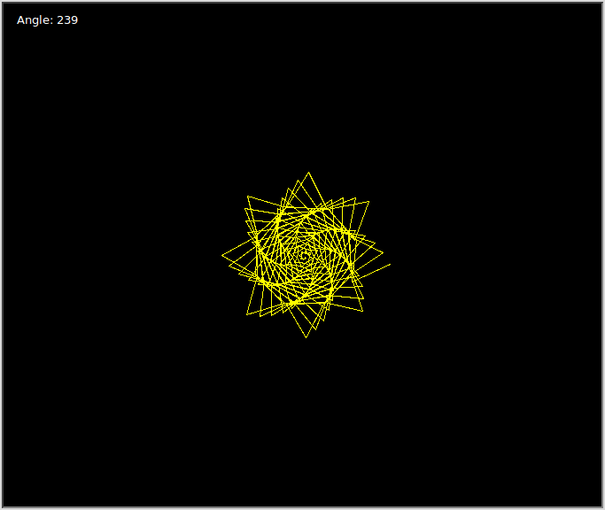
    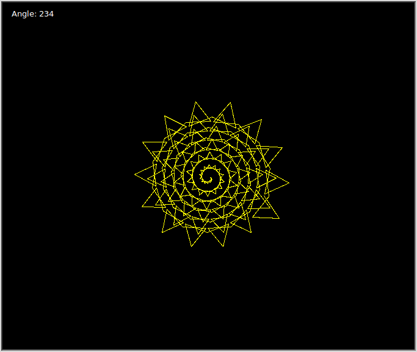
    
    
    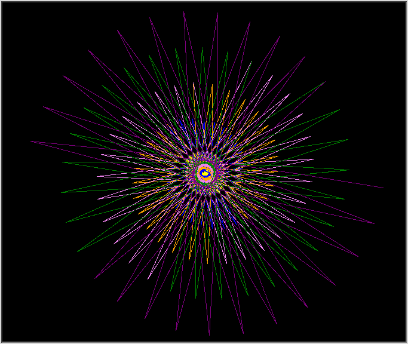
    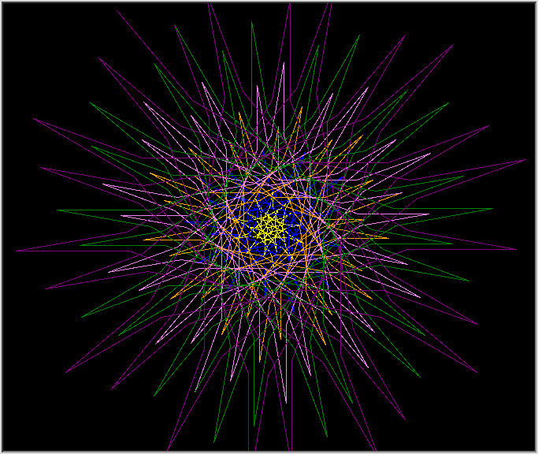
    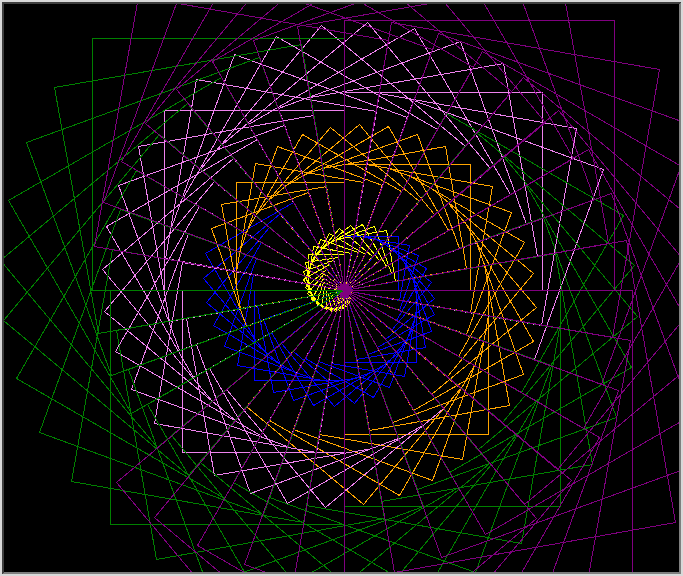
    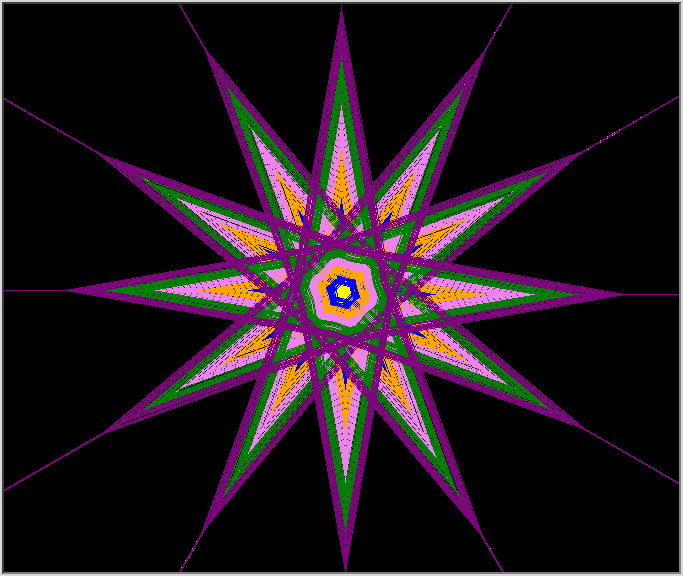
    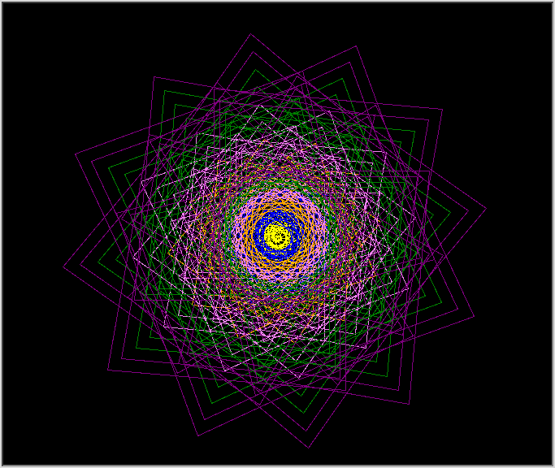

